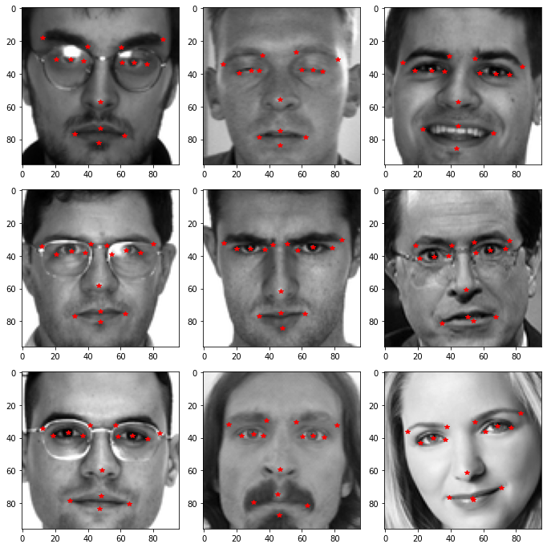
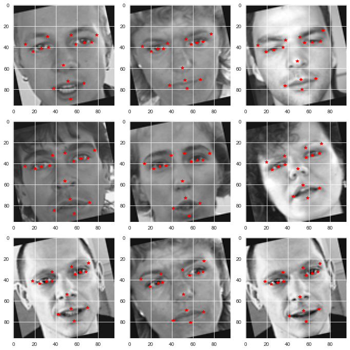

# Facial Keypoint Detection 

## Colaborators: Alex Carite, Greg Rosen, Shehzad Shahbuddin, Oscar Linares

## Project Summary 
The objective of this project is to predict facial keypoints, using a set of labeled facial features dataset provided by the original Kaggle competition. The team expirimented with multiple models and archetctures in order to achieve the final accuracy of 95% and Mean Squared Error of 0.6. 

The project team used various transfer learning models, using Keras and TensorFlow, to leverage the pre-established weights that were trained with the imagenet dataset. The models were then future tuned with a much smaller learning rate to achieve a low loss

There are many applications for this type of model, including:
 - Biometrics and facial recognition
 - Facial tracking in video
 - Building block for facial expression analysis 

This repo contains the final development notebook, the trainging and test data, and the presentation slides that were used to present to our UC Berkeley Graduate program.

## The Data 
The training data is comprised of 7,049 black and white images with resolution of 96x96 pixels. Each image was designed to have 30 labels for 15 facial features, with one x label and one y label for each facial feature. Upon initial EDA, the team discoved a large amount of missing labels for more than half of the provided trainging data. 

There were three approaches that were deployed to handle the large amount of missing labels. The first was to simply cleave any image from the dataset that did not include a fully labeled face (henceforth referred to as the 'noNA' dataset). The second and third approaches involved imputing these missing labels using k-nearest neighbors(KNN) and forward fill(ffill) techniques. As seen in later parts of the repo, while KNN and ffilll provided our data set with much more training examples, the more inacurate imputed labels led to a higher loss than the noNA training set across all models in which they were ran. 

## Data Augmentation
To increase the generalizability of our model, the team opted to use image augmentation techniques. These techniques allowed for our data set to increase from ~1,000 images to ~13,000. The images were shifted, rotated and blurred, along with brightness and noise augmentation. The resulting effect of this augmentation decreased our mean squared error quite significantly, and can be seen in the results section of this readme file.

An example of rotated images:

## Setting a Baseline

To set a baseline, which the team could use as a starting point, a simple two layer Neural Net was used with the non-augmented noNA dataset. Right from the start, we achieve an 83% accuracy. To increase the accuracy from the baseline, the model will need to become more complex with more layers and nodes. However, this baselines proves a point that for some usecases an 83% accuracy would be perfectly fine. In fact, the simplistic model may be a better fit for some applications which require a lightweight model design for their deployed build. 

## Convolutional Neural Networks

Convolutional neural networks (CNN) are great models for computer vision tasks, and showed a large jump in accuracy from our baseline model. In fact, the team was surprised at the level of accuracy a simple CNN model could produce. What the team soon learned, is that the incrimental increased from that simple CNN are increasingly challenging, and where much of the effort was focused on. 

## Transfer Learning

A helpful tactic that the team used to further increase model accuracy, was the add initialize the model with transfered weights from an already trained neural net. This transfer learning method is extremely powerful and allows the model to use already trained weights, albeit on a different training set, without the need to retrain the larger architectures. This saved the team training time while also seeing a bump in accuracy. The two pretrained models that the project experimented with, were Resnet50 and EfficientNetB7. Both of these models are well-known and are provided with pretrained weights in the keras python library.

## Comparing Models

Taking a look at the accuracy of our final models, 
